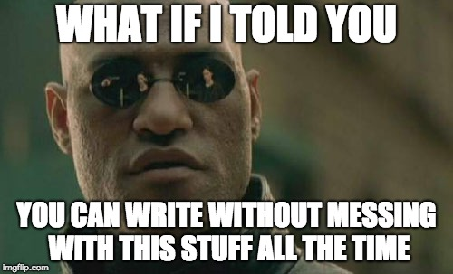
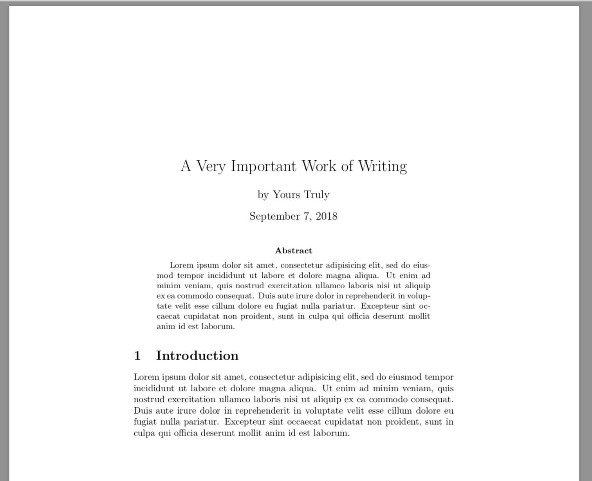

class: center, middle, inverse, title-slide

# $\mathrm{\LaTeX}$ Workshop

### Michael DeCrescenzo

### September 12, 2018

---
```{r setup, include = FALSE, cache = TRUE}
# chunks:
# hide code and messages
# cache everything
knitr::opts_chunk$set(eval = TRUE, echo = FALSE, 
                      warning = FALSE, message = FALSE,
                      cache = TRUE,
                      fig.retina = 2,
                      fig.align = "center", dpi = 100)

# Xaringan settings
library("xaringan")
library("xaringanthemer")

mono_accent(base_color = "#002b36",
            link_color = "#2aa198",
            header_font_google = google_font("Crimson Text"), 
            text_font_google = google_font("PT Sans"), 
            code_font_google = google_font("Inconsolata"), 
            code_inline_background_color    = "#F5F5F5", 
            table_row_even_background_color = "white", 
            extra_css = 
              list(".remark-slide-number" = list("display" = "none"), 
                   ".remark-inline-code" = list("background" = "#F5F5F5", 
                                                  #e7e8e2; /* darker */
                                                "border-radius" = "3px", 
                                                "padding" = "4px")))

```

class: middle, center, inverse

# The problem of document preparation

Writing a document is never *just* writing


---

class: center

## What isn't writing?

--

Margins and spacing

--

Body, heading, footer styles

--

<center>
  <blockquote class="twitter-tweet" data-lang="en"><p lang="en" dir="ltr">using microsoft word<br><br>*moves an image 1 mm to the left*<br><br>all text and images shift. 4 new pages appear. in the distance, sirens.</p>&mdash; Lgbtdes (@gossipgriII) <a href="https://twitter.com/gossipgriII/status/713425874167537664?ref_src=twsrc%5Etfw">March 25, 2016</a></blockquote>
  <script async src="https://platform.twitter.com/widgets.js" charset="utf-8"></script>
</center>

Placing tables and figures

--

Numbering sections, footnotes, figures...

--

Typing bibliographies


---

background-image: url(img/One_Eternity_Later.png)

background-size: cover


---

class: center, middle

## After all that work

Your document still looks kinda ... blah


---


class: middle, center, inverse

background-color: black




---

class: center

## Consider... $\mathrm{\LaTeX}$

--

Word processing = Writing + Typesetting

--

$\mathrm{{\LaTeX}}$: markup-based document prep

--

Markup vs. "What you see is what you get"

--

User controls *content*; computer handles tedious stuff

--

Easily manage complex documents *at scale*


---

class: center, middle

## No really, what is $\mathrm{{\LaTeX}}$?

1. User writes a source file, containing text plus markup

2. Computer interprets the markup, automatically formats the text

3. Resulting document is *typographically principled* and therefore gorgeous


---

### Turn this...

```
\documentclass{article}

\begin{document}

\title{A Very Important Work of Writing}
\author{by Yours Truly}
\date{\today}
\maketitle

\begin{abstract}
  Lorem ipsum dolor sit amet, consectetur adipisicing elit, sed do eiusmod
  tempor incididunt ut labore et dolore magna aliqua. Ut enim ad minim veniam,
  quis nostrud exercitation ullamco laboris nisi ut aliquip ex ea commodo
  consequat. Duis aute irure dolor in reprehenderit in voluptate velit esse
  cillum dolore eu fugiat nulla pariatur. Excepteur sint occaecat cupidatat non
  proident, sunt in culpa qui officia deserunt mollit anim id est laborum.
\end{abstract}

\section{Introduction}

Lorem ipsum dolor sit amet, consectetur adipisicing elit, sed do eiusmod
tempor incididunt ut labore et dolore magna aliqua. Ut enim ad minim veniam,
quis nostrud exercitation ullamco laboris nisi ut aliquip ex ea commodo
consequat. Duis aute irure dolor in reprehenderit in voluptate velit esse
cillum dolore eu fugiat nulla pariatur. Excepteur sint occaecat cupidatat non
proident, sunt in culpa qui officia deserunt mollit anim id est laborum.

\end{document}
```


---

### Into this

<center>

</center>


---

## Writing $\mathrm{\LaTeX}$

Source code is a plain text file with a `.tex` extension

--

Text plus markups. Markups are logical (`\author{Bucky}`) or typographical (`\emph{emphasized text}`)

--

Preamble and body:

- The *preamble* sets document-level options and parameters
- The *body* contains the content

--

Compile the document to `pdf`. Errors if compilation fails.

--

`pdf` output: slimmer, less finicky, more compatible


---

## History (and terminology)

Typesetting used to be a *physical process*

--

 1978: Donald Knuth creates $\mathrm{\TeX}$ (or $\tau \epsilon \chi$) for digital typesetting

$\mathrm{\TeX}$ had a coding language and a compilation engine

--

Some time later: Leslie Lamport gives us $\mathrm{{\LaTeX}}$

- *front-end* revision
- allows you to write nicer code that is still interpreted by the $\mathrm{\TeX}$ compiler


---

## An irritating aside about "engines"

--

Three main ways to turn `.tex` files into output

--


- $\mathrm{pdf\TeX}$ (and $\mathrm{pdf\LaTeX}$): the classic routines to turn a `.tex` file into a `.pdf`. Will be around forever. Good typography, but old. 

--

- $\mathrm{Xe\TeX}$: Designed to accept a broader range of input characters and more font flexibility. Handy if you need to type in non-English (especially non-Romantic) languages and $\mathrm{pdf\TeX}$ is giving you headaches.

--

- $\mathrm{Lua\TeX}$: Sort of like a re-writing of $\mathrm{\TeX}$ that runs on Lua. If you don't know what that means, don't use it.

--

We'll use $\mathrm{pdf\LaTeX}$. You probably don't need more.


---

## Justifying the learning curve

--

$\mathrm{\LaTeX}$ solves tons of common problems with word processing
--

- placing figures and tables
--

- complex math
--

- bibliography management
--

- import results from R and Stata
--

- and look good doing it

--

"But can $\mathrm{\LaTeX}$ do..."

--

- Track changes? Yes, with [Git](https://git-scm.com/)
--

- Word count? Yes, use [pdfCount](https://github.com/leeper/pdfcount)
--

- Spell check? [TeXCheckR](https://cran.r-project.org/web/packages/TeXCheckR/index.html) (or get a good code editor)
--

- Grammar check? Not that I know of
--

- [Exactly reproduce the appearance of another document?](https://journals.plos.org/plosone/article?id=10.1371/journal.pone.0115069) No, but **that isn't the point**

--

$\mathrm{\LaTeX}$ will save you time and effort on complex documents, and it signals professionalism


---

## $\mathrm{\LaTeX}$ elsewhere in the wild

--

MathJax for `HTML`

--

R-Markdown and Rnw for interactive, "notebook-style" R documents

--

R package `latex2exp`: insert pretty math into graphics

--

R package `tikzDevice`


---


## Agenda

--

Today

- Get up and running

- Text (and lists), math (and equations)

- Figures, tables

--

Next week


- Bibliographies

- Workflow integration

- Slides (Beamer)

- (NEW) R-Markdown (and Rmd-style slides)


---

class: center

## Conclusion


--

$\mathrm{\LaTeX}$ will change your life, **if you let it**

--

Requires some investment, but it pays off

--

Builds other computer skills, which are transferable

--

Professionalism

--

Look good, feel good


---

class: center, middle, inverse

## Rev up those `.tex` files


